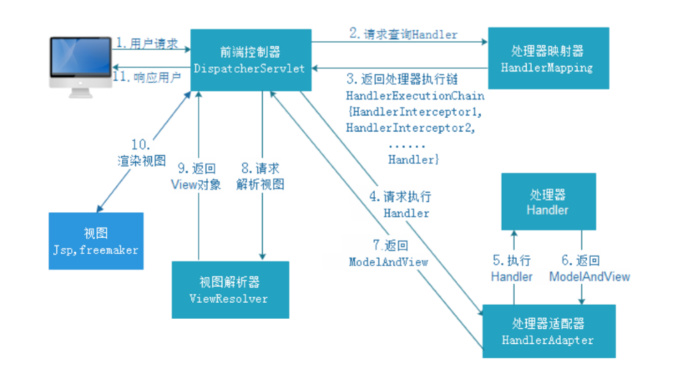

# Spring MVC
#### 什么是Spring MVC
```
Spring MVC是Spring给我们提供的一个用于简化web开发的轻量级框架

Spring MVC通过一套注解，让一个简单的Java类成为处理请求的控制器，而无需实现任何接口。同时他还支持RESTful编程风格的请求。

Spring MVC可以认为是Servlet的封装，简化了我们servlet的开发
```

#### MVC三层体系结构
1. 表现层
    ```
    表现层（WEB层）负责接收客户端请求，向客户端响应结果，通常客户端使用http/https协议请求。
   
    WEB层需要接收http/https请求，并完成http/https响应。
   
    表现层包括展示层和控制层：展示层负责结果的展示，控制层负责接收请求。
   
    表现层依赖业务层，接收到客户端请求一般会调用业务层进行业务处理，并将处理结果响应给客户端。
   
    表现层的设计一般都使用MVC模型。MVC是表现层的设计模型，和其他层没有关系。
    ```
   
2. 业务层
    ```
    业务层（Service层）负责业务逻辑处理，和开发项目的需求息息相关。
   
    WEB层依赖业务层，但是业务层不依赖WEB层。
   
    业务层在业务处理时可能会依赖持久层，如果需要对数据持久化那么要保证事务一致性。
    ```
   
3. 持久层
    ```
    持久层（DAO层）负责数据持久化。
   
    持久层包括数据层和数据访问层：数据层是数据持久化的载体，数据访问层是业务层和持久层交互的接口。
    通俗的讲，持久层就是和数据库交互的，对数据库表进行增删改查的
    ```
   
|层级|简写|全称|描述|
|:---:|:---:|:---:|:---|
|模型|M|model|封装数据模型：pojo、vo、po和业务模型|
|视图|V|view|负责页面展示：jsp、html|
|控制|C|controller|负责请求处理：servlet|

#### Spring MVC 工作流程

1. 用户发送请求到前端控制器DispatcherServlet
2. DispatcherServlet收到请求后，调用HandlerMapping处理器映射器
3. 处理器映射器根据请求Url找到具体的Handler（后端控制器），生成处理对象及处理器拦截器（如果有，则生成）并返回给DispatcherServlet
4. DispatcherServlet收到处理器对象后，调用HandlerAdapter处理器适配器去调用Handler
5. 处理器适配器执行Handler
6. Handler对象执行完毕后，返回ModelAndView给处理器适配器（ModelAndView是SpringMVC框架的一个底层对象，包含Model和View）
7. 处理器适配器将ModelAndView返回给DispatcherServlet
8. DispatcherServlet请求视图解析器进行视图解析，根据逻辑视图名来解析真正的视图。
9. 视图解析器将解析好的View视图返回给DispatcherServlet
10. DispatcherServlet对视图进行渲染，就是将模型数据（ModelAndView）填充到request请求域中
11. DispatcherServlet向用户响应结果

#### Spring MVC 九大组件
1. HandlerMapping（处理器映射器）
   ```
   HandlerMapping是用来查找Handler（处理器）的，处理器具体的表现形式可以是类，也可以是方法。
   比如：使用注解@ResultMapping标注的每个方法都可以看成是一个Handler。
   Handler负责具体实际的请求处理，在请求到达后，HandlerMapping的作用便是找到请求响应的Handler和Interceptor。
   ```
2. HandlerAdapter（处理器适配器）
   ```
   HandlerAdapter是一个适配器。因为SpringMVC中Handler可以是任意形式的，只要能处理请求即可。
   但是把请求交给Servlet的时候，由于Servlet的方法结构都是doService(HttpServletRequest req, HttpServletResponse resp)形式的，
   要让固定的Servlet处理方法调用Handler来进行处理，便是HandlerAdapter的职责。
   ```
3. HandlerExceptionResolver（异常解析器）
   ```
   HandlerExceptionResolver用于处理Handler产生的异常情况。
   它的作用是根据异常设置ModelAndView，之后交个渲染方法进行渲染。
   ```
4. ViewResolver（视图解析器）
   ```
   ViewResolver用于将String类型的视图名和Locale解析为View类型的视图。
   ViewResolver只有一个resolveViewName()的方法。
   ViewResolver在这个过程主要完成两件事情：
       1. 找到渲染所使用的模板
       2. 找到渲染所使用的视图类型
   ```
5. RequestToViewNameTranslator
   ```
   RequestToViewNameTranslator组件的作用是从请求中获取ViewName。
   因为ViewResolver根据ViewName查找View，但是有的Handler处理完成之后没有设置View，也没有设置ViewName，此时便要通过该组件从请求中查找ViewName。
   ```
6. LocaleResolver
   ```
   ViewResolver组件的resolveViewName()方法需要两个参数，一个是视图名，一个是Locale。
   LocalResolver用于从请求中解析出Locale，比如：中国Locale是zh-CN
   ```
7. ThemeResolver
   ```
   ThemeResolver是用来解析主题的。主题是样式、图片以及他们所形成的显示效果的集合。
   SpringMVC中一套主题对应一个properties文件，里面存放着与当前主题相关的所有资源，如图片、css样式等。
   SpringMVC中与主题相关的类有ThemeResolver、ThemeSource和Theme：
       ThemeResolver负责从请求中解析出主题名
       ThemeSource根据主题名找到具体的主题，其抽象是Theme，可以通过Theme来获取主题和具体的资源。
   ```
8. MultipartResolver
   ```
   MultipartResolver用于上传请求，通过将普通的请求包装成MultipartHttpServletRequest来实现。
   MultipartHttpServlet可以通getFile()方法直接获取文件。如果上传多个文件，还可以调用getFileMap()得到Map<FileName,File>这样的结构。
   MultipartResolver的作用就是封装普通的请求，使其拥有文件上传的功能。
   ```
9. FlashMapManager
   ```
   FlashMap用于重定向时的参数传递。
   只需要在重定向之前将要传递的数据写入请求（通过ServletRequestAttributes.getRequest方法获得）的属性中，之后就可以直接从Model中获取数据。
   FlashMapManager就是用来管理FlashMap的
   ```
   
#### REST风格请求
+ 什么是RESTful：
  ```
  REST（Representational State Transfer）资源表现层状态转换
  RESTful是一种web软件架构风格，它不是标准也不是协议，
  它倡导的是一个资源定位及资源操作的风格。
  ```
+ REST的优点：
  ```
  结构清晰、符合标准、易于理解、方便扩展
  ```
+ REST的特性：
  ```
  资源：网络上的一个实体，或者说是网络上的一个具体信息。
        可以用一个URI（统一资源定位符）指向它，每种资源对应一个特定的URI，这个URI是独一无二的。
  
  表现层：把资源具体呈现出来的形式，叫做它的表现层。
  
  状态转化：每发出一个请求，就代表客户端和服务器的一次交互过程
  ```
+ REST：
  ```
  GET：查询资源
  POST：增加资源
  PUT：更新资源
  DELETE：删除资源
  ```
   
#### Ajax Json交互
1. 前端到后台：前端ajax发送json格式字符串，后台直接接收为pojo参数，使用注解@RequestBody
2. 后台到前端：后台直接返回pojo对象，前端直接接收为json对象或者字符串，使用注解@ResponseBody
   
   
   
   
   
   
   
   
   
   
   